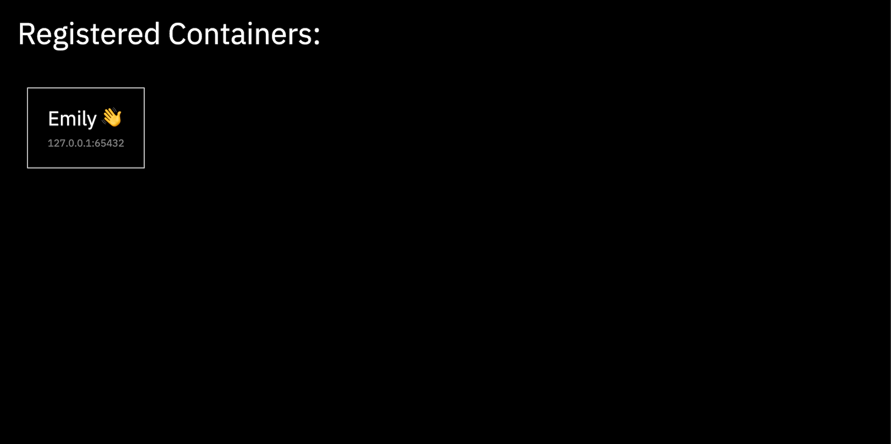

======
Server
======

The purpose of the server to send telemetry data to connected applications. Applications
can ``register`` and ``deregister``. While registered, telemetry data is sent to the
applications at the provided port.

Development
===========

This project requires Python 3.7 or greater.

Installation
------------

To install the application and its dependencies::

  $ make install

Run
---

To start the application::

  $ make run

Usage
=====

The homepage will display a list of connected users. To access the homepage::

  http://127.0.0.1:5000/

To access the server from other devices on the same network, the IP address of the server
should be substituted for ``127.0.0.1``.

Register
--------

To register a new device, the user sends a ``POST`` request with a payload containing
their username and a ``port``.

By determining the IP address of the sender, telemetry data is then sent to the user on the provided port.

Here is an example request to ``register``::

  >>> import requests
  >>> requests.post("http://127.0.0.1:5000/register", json={"username": "Emily 👋", "port": 65432})

Deregister
----------

To de-register an application and stop receiving telemetry data, the user sends a ``POST`` request to the
``deregister`` endpoint. This will drop the user's information and they will no longer be sent telemetry
data by the server.

Here is an example request to ``deregister``::

  >>> import requests
  >>> requests.get("http://127.0.0.1:5000/deregister", json={"username": "Emily 👋", "port": 65432})

Receiving telemetry data
------------------------

Once a user is registered, the server will begin to try to send data at a fixed time
interval to the IP address of the user, at the registered port.

To accept and receive this data, you can follow the instructions of the ``README`` in the
`client service`_.

.. _client service: ../client/README.rst
